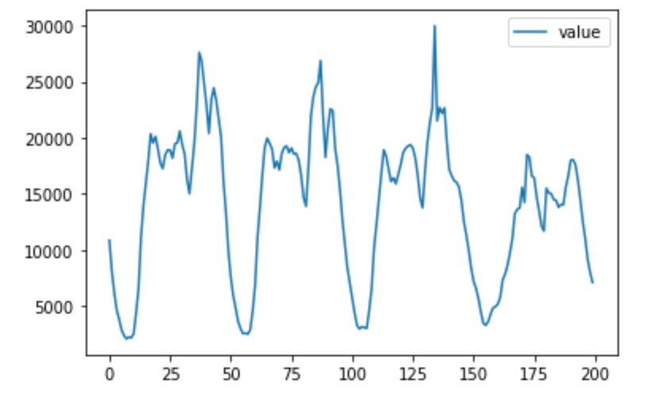

# Forecasting timeseries with the Metered Prophet API

## Forecasting timeseries

Forecasting timeseries is a common problem in data science/machine learning. It asks, given a set of observations of the past, what the future will look like.

Some real world applications of timeseries forecasting include:

- [Sales/demand forecasting](https://hbr.org/1971/07/how-to-choose-the-right-forecasting-technique): Say you're an ice cream chain. You might expect that sales will be much higher in the summer and lower in the winter, but trend higher year-over-year overall you're investing in advertising. The sales forecasts would be useful for things like setting quota for your salespeople, financial disclosure/valuation, and inventory planning.
- [Capacity planning](https://www.youtube.com/watch?v=4nLwB2mApiU): In a software context, capacity planning refers to ensuring enough compute resources to serve expected traffic. More broadly, capacity planning asks, how many servers, employees, meals, parking spaces, etc., are going to be needed?
- [Observability and Monitoring](https://docs.seldon.io/projects/alibi-detect/en/stable/examples/od_prophet_weather.html): Anomalies in timeseries can reflect software outages. For instance, if the number of trips requested is suddenly much lower than expected, that might indicate a bug in the Uber app.

---

## Facebook Prophet

This API implements the [Prophet](https://github.com/facebook/prophet) open-source forecasting library for timeseries developed by Facebook's data science team. It's an additive regression model that combines a piece-wise linear component with yearly and monthly seasonal components, as well as a user-provided list of holidays. It works particularly well on timeseries that are seasonal, and is robust to missing data/outliers.

---

## Benefits of using a Metered API

Prophet is already available as a Python and R package, but with **Metered**, you can access a production-ready version of it via a simple API call.

The benefits of Metered over running the packages yourself include:

- no need to install anything locally
- massive parallelism possible with concurrent requests
- ability to use places that don't run Python or R

---

## Considerations

- The Metered Prophet API is available in [GraphQL](https://graphql.org/learn/schema/). There is no REST API.
- Pricing for any Metered API is per request. The Metered Prophet API provides a free tier of up to <# free requests> requests. Please refer to the Metered Prophet API landing page for complete pricing details.

---

## How this guide works

The code snippets in this guide are intended to be run interactively as you follow along. The snippets are also interrelated, so outputs are automatically propagated from snippet to snippet, as needed. This is an experimental format that we're eager to receive feedback on. Please send us a note with any thoughts you have.

For ease of use, the API keys in this guide are real keys. You can copy-and-paste them right into your code. The keys have a dynamic rate limit. To access a higher rate limit, create an account and provider your credit card information.

---

## Getting Started

Below, we show how to accomplish a common forecasting flow using the Metered Prophet API. Recall that GraphQL allows you to create services by defining types and fields on those types, then providing functions for each field on each type. The Metered Prophet API is running a GraphQL service that looks like this:

```graphql
historyFromRecords(
    records: [PastEvent!]
): History!
```

```graphql
type History {
    fitProphet(...): ProphetModelWithHistory
}
```

```graphql
type ProphetModelWithHistory {
    id: String!
    state: String
    forecast(...): Forecast
}
```

All GraphQL API queries are made on a single endpoint, which only accepts POST requests:

`` card api=prophet type=about

````

``` card api=prophet type=callout
url
apiKey
````

### 1. Loading Timeseries

The first step is to load your raw data into memory.

Your raw data should be in a csv file format with two columns: ```ds``` and ```y```, containing the date and numeric value respectively. The ```ds``` column should be ```YYYY-MM-DD``` for a date, or ```YYYY-MM-DD HH:MM:SS``` for a timestamp.

As our case study in this guide, we would like to forecast the number of Wikimedia pageviews for observability purposes -- if the number of pageviews is ever much lower than expected, this might indicate a softare outage.

We have three years worth of Wikimedia data at a daily granularity: 

<!-- Continuing the Uber example from above, say we want to detect anomalies in a `trips` metric that might indicate an outage. As a proxy for the `trips` metrics we'll use a dataset of the number of NYC taxi passengers released by the NYC Taxi and Limousine Commission. The data here consists of aggregating the total number of taxi passengers into 30 minute buckets. -->

This is what the first couple rows of the csv looks like:

| ds           | y |
| ------------------- | ----- |
| 2018-01-01 | 302828330 |
| 2018-01-02 | 319485738 |
| 2018-01-03 | 322019675 |



As you can see, this metric has a daily and weekly seasonality that makes Prophet a good fit.

https://colab.research.google.com/drive/1YUw5WDSlo34pDC8__NO-SyUVJAm23Leb

We use ```historyFromURL``` to load a hosted csv file into memory. We also specify the column names, in this case ```timestamp``` and ```value```

```graphql
{
  historyFromURL(url: "https://raw.githubusercontent.com/numenta/NAB/master/data/realKnownCause/nyc_taxi.csv", schema:{ds:"timestamp", y:"value"}) {
      records {
        ds
        y
      }
    }
}
```

The above process loads data for a single timeseries. In practice, you'll often want to forecast multiple timeseries in parallel (Even a single metric/timeseries often needs to be forecasted multiple times , for instance for different cities/countries). For instructions on how to do that, you can refer to the guide for the [Generic Batch Job API](https://gist.github.com/ajbouh/fb9037f723a9706f05f9f43d680a19c6). The instructions there will import the raw data from a csv file and perform some aggregation/cleaning, then save it in a _sqlite_ database.


### 2. Fitting the Prophet model

The next step is to fit the Prophet model, which can be done by querying `fitProphet` on the `history` type. `fitProphet` returns a type `ProphetModelWithHistory`.

```graphql
{
   historyFromURL(url: "https://raw.githubusercontent.com/numenta/NAB/master/data/realKnownCause/nyc_taxi.csv", schema:{ds:"timestamp", y:"value"}) {
    resample(rule: "1D") {
      fitProphet {
        forecast(futureRecords: [{ds:"2020-01-14"}]) {
          future {
            records {
              ds
              yhat
              yhatLower
              yhatUpper
            }
          }
        }
      }
    }
  }
}

}
```

### 3. Forecasting using the Prophet model.

The next step is to use the trained model to forecast the data into the future. This can be done by querying `forecast` on the `ProphetModelWithHistory` type. `forecast` takes a `futureRecords` parameter, and returns a `Forecast` type.

```graphql
   {
	historyFromURL(url: "https://raw.githubusercontent.com/numenta/NAB/master/data/realKnownCause/nyc_taxi.csv", schema:{ds:"timestamp", y:"value"}) {
        fitProphet {
            # state
            forecast(futureRecords: [{ds:"2020-01-14"}], includeHistory: true) {
                ...
            }
        }
	}
}
```

### 4. Retrieve summary statistics and forecast metrics from Forecast

The final step is to retrieve summary statistics and the forecasted data, which can be done starting at the `history` and `future` fields on `Forecast` type. Recall that GraphQL returns only the leaves of the graph, and you have to specify the entire path down to any particular leaf that you want.

```graphql
{
  historyFromRecords(
    records: [{ ds: "2020-01-02", y: 2 }, { ds: "2020-01-12", y: 12 }]
  ) {
    fitProphet {
      # state
      forecast(futureRecords: [{ ds: "2020-01-14" }], includeHistory: true) {
        history {
          records {
            ds
            y
            yhat
            error
          }
          metrics {
            me
            mse
            mpe
            nrmse
          }
        }
        future {
          records {
            ds
            yhat
            yhatLower
            yhatUpper
          }
        }
      }
    }
  }
}
```

_exported into a colab and visualize the timeseries as well as the forecast_

What happens if you run Prophet and you don't like the results?

You can easily tune the model by changing up parameters like the number of changepoints in the piece-wise linear model, which determines how "flexible" the curve is. For a full reference on the parameters of a Prophet model, check out \_\_.

## Next Steps

At this point, you can use the confidence intervals on the forecast to create a set of thresholds that indicate upper and lower alerting bounds. When the metric crosses the bound in either direction, you can send out an alert.

_timeseries forecasting -- should we talk about backtesting?_
